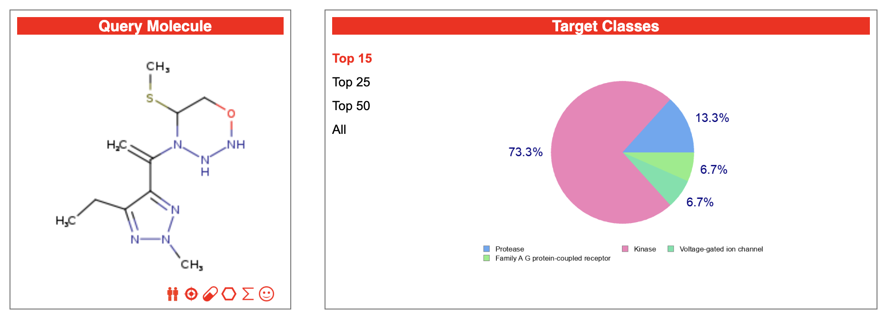
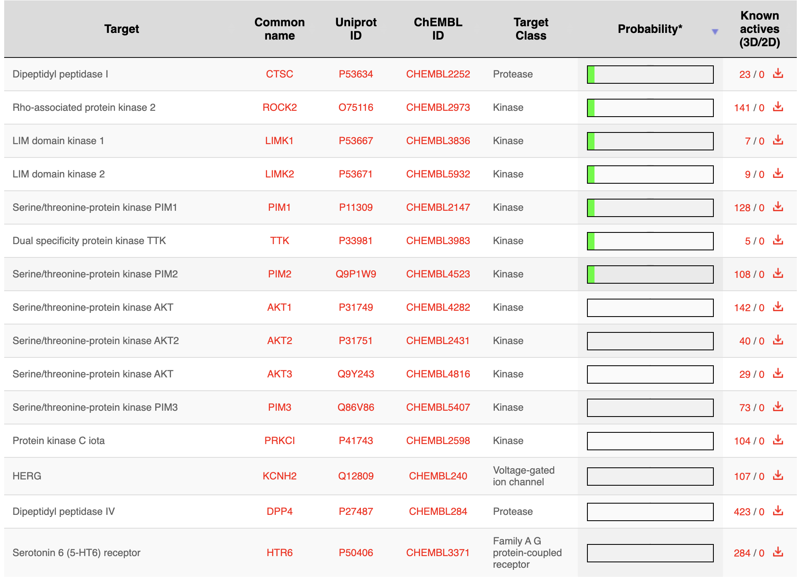

# Darwin-Gödel Machine: Open-Ended Molecular Evolution Through Hierarchical Mutation and Self-Improvement

## Abstract

This program implements an open-ended evolutionary system for molecular discovery that combines principles from Darwinian evolution, Gödel's incompleteness theorem (through self-modifying prompts), and Kenneth Stanley's novelty search paradigm. The system evolves molecular structures through a hierarchical mutation strategy, balancing exploitation of high-fitness molecules with exploration of novel chemical space to avoid local optima and discover diverse, high-quality drug-like compounds.


*Figure 1: BOILED-Egg plot showing gastrointestinal absorption (white region) and blood-brain barrier penetration (yellow region) predictions. The red dot indicates a P-glycoprotein non-substrate (PGP-), suggesting the molecule won't be actively effluxed.*


*Figure 2: Comprehensive molecular property analysis showing physicochemical properties, water solubility predictions, pharmacokinetics, drug-likeness scores, and medicinal chemistry metrics. The bioavailability radar (top) provides a quick visual assessment of six key drug-like properties.*

## Scientific Background

### Theoretical Foundation

The Darwin-Gödel Machine (DGM) draws inspiration from three key theoretical frameworks:

1. **Darwinian Evolution**: Natural selection operating on a population of molecular candidates with heritable variation
2. **Gödel's Incompleteness**: Self-referential improvement where the system modifies its own mutation operators (prompts) based on empirical performance
3. **Open-Ended Evolution**: Stanley's principle that novelty and diversity are essential for avoiding deceptive local optima in complex fitness landscapes

### Key Innovation: Hierarchical Mutation Strategy

The system employs a three-tier mutation hierarchy operating at different temporal scales:

- **Generation 1-∞**: Continuous genetic mutations (atom substitutions, bond modifications)
- **Every 10 generations**: LLM-guided intelligent mutations using contextual chemical knowledge
- **Every 50 generations**: Meta-evolutionary prompt refinement based on empirical performance metrics

This hierarchical approach mirrors biological evolution's multiple timescales: point mutations (fast), regulatory changes (medium), and architectural innovations (slow).

## Methodology

### 1. Molecular Representation and Fitness

**Representation**: Molecules are encoded as SMILES (Simplified Molecular Input Line Entry System) strings, enabling both symbolic manipulation and chemical validity checking through RDKit.

**Fitness Function**: Quantitative Estimate of Drug-likeness (QED), which combines:
- Molecular weight (optimal: 200-500 Da)
- Lipophilicity (logP: -0.4 to 5.6)
- Hydrogen bond donors/acceptors
- Polar surface area
- Rotatable bonds
- Aromatic rings
- Structural alerts

**Novelty Metric**: Tanimoto distance between molecular fingerprints, measuring structural dissimilarity from previously explored molecules.

### 2. Evolution Dynamics

#### Population Management
- **Size**: 10 molecules per generation (configurable)
- **Selection**: Adaptive strategy based on plateau detection
  - Normal: 50% fitness-based, 50% novelty-based selection
  - Plateau (>30 generations without improvement): 70% novelty, 30% fitness
  - Novelty push (every 25 generations): Force pure novelty selection

#### Mutation Operators

**Genetic Mutations** (Every Generation):
- Atom substitution (C→N, N→O, O→S, etc.)
- Atom addition/removal
- Bond type modification
- Random SMILES character mutations with validity checking

**LLM-Guided Mutations** (Every 10 Generations):
- Context-aware mutations using Google Gemini
- Considers chemical feasibility and synthetic accessibility
- Maintains chemical validity through iterative attempts

**Prompt Self-Modification** (Every 50 Generations):
- Empirical assessment of prompt performance
- Meta-prompt requests improved mutation strategies based on:
  - Performance metrics over last 50 generations
  - Types of successful vs. unsuccessful mutations
  - Current population diversity
  - Identified bottlenecks

### 3. Open-Ended Evolution Mechanisms

#### Novelty Archive
Maintains a collection of highly novel molecules (Tanimoto distance > 0.7) as "stepping stones" for future exploration. Archive size: up to 1000 molecules.

#### Plateau Detection and Response
- **Detection**: No fitness improvement for 30+ generations
- **Response**: Shift selection pressure toward novelty, inject archived diverse molecules

#### Diversity Restart
Every 200 generations without substantial progress: reinitialize population with diverse seeds from the novelty archive.

#### Adaptive Selection Pressure
Dynamically adjusts the fitness/novelty balance based on:
- Recent progress (generations since best molecule found)
- Population diversity metrics
- Archive growth rate

## Implementation Details

### Technical Architecture

```
Main Evolution Loop
├── Population Initialization
├── Fitness Evaluation (QED via RDKit)
├── Novelty Calculation (Tanimoto distance)
├── Selection (Adaptive fitness/novelty balance)
├── Mutation Pipeline
│   ├── Genetic mutations (every gen)
│   ├── LLM mutations (every 10 gen)
│   └── Prompt refinement (every 50 gen)
├── Archive Management
│   ├── Fingerprint archive (all molecules)
│   └── Novelty archive (stepping stones)
├── Logging and Visualization
└── Plateau Detection and Response
```

### Dependencies

- **RDKit**: Chemical informatics and validity checking
- **NumPy/Pandas**: Numerical operations and data management
- **Matplotlib**: Fitness/novelty visualization
- **Google Gemini API**: LLM-guided mutations
- **Python 3.7+**: Core runtime

### Output Structure

```
dgm_evolution_runs/
└── run_[timestamp]/
    ├── snapshots/      # JSON logs of population state
    ├── plots/          # Fitness and novelty graphs
    ├── prompts/        # Evolution of mutation prompts
    ├── molecules/      # Top discovered molecules
    └── summaries/      # Human-readable progress reports
```

## Results and Metrics

### Primary Metrics

1. **All-Time Best Fitness**: Monotonically increasing QED score
2. **Average Novelty**: Population diversity measure
3. **Plateau Length**: Generations since last improvement
4. **Archive Growth**: Rate of novel molecule discovery

### Visualization

The system generates plots showing:
- All-time best fitness trajectory (blue line)
- Average population novelty (green line)
- LLM mutation events (orange dashed lines)
- Prompt refinement events (red solid lines)

### Expected Behavior

1. **Early Phase** (Gen 0-50): Rapid fitness improvement through exploitation
2. **Middle Phase** (Gen 50-200): Plateau detection, increased novelty exploration
3. **Late Phase** (Gen 200+): Oscillation between exploitation and exploration
4. **Open-Ended Phase**: Continuous discovery of diverse, high-quality molecules

## Scientific Significance

### Contributions to Evolutionary Computation

1. **Hierarchical Mutation**: Demonstrates value of multi-timescale variation
2. **Self-Improving Operators**: Meta-evolution of mutation strategies
3. **Novelty Preservation**: Maintains diversity through explicit archiving
4. **Adaptive Selection**: Dynamic fitness/novelty balance based on progress

### Applications

- **Drug Discovery**: Generate novel drug-like molecules
- **Material Science**: Explore chemical space for new materials
- **Evolutionary Theory**: Study open-ended evolution in simplified domain
- **AI Research**: Test self-improvement and meta-learning strategies

### Theoretical Implications

The system serves as a concrete implementation of several theoretical concepts:

1. **Incompleteness and Self-Reference**: The prompt modification mechanism creates a Gödel-like scenario where the system reasons about and modifies its own operation
2. **Novelty as Stepping Stones**: Demonstrates Stanley's hypothesis that preserving novelty enables crossing deceptive fitness landscapes
3. **Multi-Scale Evolution**: Shows how different mutation rates at different scales can improve evolutionary search

## Usage

### Basic Execution

```bash
# Set API key
export GEMINI_API_KEY="your-api-key"

# Install dependencies
pip install rdkit-pypi numpy pandas matplotlib google-genai

# Run evolution
python3 main.py
```

### Configuration

Key parameters (modify in source):
- `POPULATION_SIZE`: Number of molecules per generation (default: 10)
- `LLM_MUTATION_INTERVAL`: Generations between LLM mutations (default: 10)
- `PROMPT_REFINEMENT_INTERVAL`: Generations between prompt updates (default: 50)
- `PLATEAU_THRESHOLD`: Generations without improvement to trigger novelty focus (default: 30)
- `MIN_NOVELTY_THRESHOLD`: Minimum Tanimoto distance for "interesting" molecules (default: 0.7)

## Validation with Online Tools

### SwissADME and SwissTargetPrediction

After generating novel molecules, you can validate their drug-like properties and predict potential biological targets using Swiss Institute of Bioinformatics' web tools:

#### 1. SwissADME (https://www.swissadme.ch/)

SwissADME provides comprehensive evaluation of pharmacokinetics, drug-likeness, and medicinal chemistry friendliness of small molecules.

**How to use:**
1. Navigate to https://www.swissadme.ch/
2. Paste your generated SMILES string(s) in the input box (one per line)
3. Click "Run" to analyze
4. Review the comprehensive report including:
   - **BOILED-Egg plot**: Visual prediction of gastrointestinal absorption and brain penetration
   - **Bioavailability Radar**: Six physicochemical properties for oral bioavailability
   - **Pharmacokinetics**: ADME predictions
   - **Drug-likeness**: Lipinski, Ghose, Veber, Egan, and Muegge filters
   - **Medicinal Chemistry**: PAINS alerts and synthetic accessibility

#### 2. SwissTargetPrediction (https://www.swisstargetprediction.ch/)

SwissTargetPrediction estimates the most probable macromolecular targets of a small molecule based on similarity to known bioactive molecules.

**How to use:**
1. Navigate to https://www.swisstargetprediction.ch/
2. Either:
   - Draw your molecule using the integrated structure editor, or
   - Paste the SMILES string directly
3. Select organism (Homo sapiens for human targets)
4. Click "Predict targets" to run analysis
5. Review predicted targets ranked by probability


*Figure 3: Distribution of predicted target classes. In this example, kinases represent 73.3% of predicted targets, followed by proteases (13.3%), indicating the molecule's likely mechanism of action involves kinase inhibition.*


*Figure 4: Top predicted molecular targets with probability scores and known active compounds. Green bars indicate high confidence predictions. The table shows specific kinases (ROCK2, LIMK1/2, PIM family) and proteases (CTSC, DPP4) as likely targets, with links to ChEMBL database entries for validation.*

### Interpreting Results

#### Key Metrics to Evaluate:

**From SwissADME:**
- **Lipinski's Rule of Five**: All parameters should be within limits for oral bioavailability
- **Bioavailability Score**: Higher scores (0.55-1.0) indicate better oral bioavailability
- **Synthetic Accessibility**: Lower scores (1-4) indicate easier synthesis
- **PAINS Alerts**: Should be 0 for drug candidates (avoid promiscuous binders)
- **LogP (lipophilicity)**: Optimal range 0-3 for most drugs
- **TPSA**: <140 Ų for good oral absorption

**From SwissTargetPrediction:**
- **Probability Score**: >0.5 indicates high confidence predictions
- **Target Class Distribution**: Helps understand mechanism of action
- **Known Actives**: Number of similar compounds with confirmed activity
- **Target Diversity**: Multiple target classes may indicate polypharmacology

### Validation Workflow

1. **Initial Screening**: Extract top molecules from evolution (check `molecules/` directory)
2. **ADME Analysis**: Run SwissADME to filter molecules with poor drug-like properties
3. **Target Prediction**: Use SwissTargetPrediction for promising candidates
4. **Iterative Refinement**: Feed validation results back into prompt refinement for targeted evolution

### Example Analysis

For the molecule shown in the screenshots (SMILES: `CSC1CONNN1C(=C)c1nn(nc1CC)C`):

**Strengths:**
- Good water solubility (Log S = -2.70)
- High GI absorption predicted
- Favorable bioavailability score (0.55)
- No PAINS or Brenk alerts
- Reasonable synthetic accessibility (4.22)

**Considerations:**
- Not BBB permeant (may be desirable depending on target)
- Multiple kinase targets predicted (potential for both efficacy and side effects)
- Molecular weight (270 Da) leaves room for optimization

This validation data can inform the next evolution cycle by updating the mutation prompts to maintain favorable properties while exploring chemical space.

## Limitations and Future Directions

### Current Limitations

1. **Fitness Function**: QED is a simplified drug-likeness metric; real drug discovery requires multiple objectives
2. **Chemical Space**: Limited to small organic molecules representable in SMILES
3. **Computational Cost**: LLM API calls add latency and cost
4. **Validation**: No experimental validation of generated molecules

### Future Enhancements

1. **Multi-Objective Optimization**: Include synthesizability, toxicity, target binding
2. **Graph Neural Networks**: Replace fingerprints with learned representations
3. **Automated Hyperparameter Tuning**: Meta-optimization of evolution parameters
4. **Distributed Evolution**: Parallel populations with migration
5. **Active Learning**: Experimental feedback loop for promising candidates

## Citation

If you use this code in your research, please cite:

```bibtex
@software{dgm_evolution,
  title={Darwin-Gödel Machine: Open-Ended Molecular Evolution},
  author={[Author Name]},
  year={2024},
  url={https://github.com/[repository]}
}
```

## References

1. Stanley, K.O. & Lehman, J. (2015). *Why Greatness Cannot Be Planned: The Myth of the Objective*. Springer.
2. Gómez-Bombarelli, R. et al. (2018). Automatic chemical design using a data-driven continuous representation of molecules. *ACS Central Science*, 4(2), 268-276.
3. Bickerton, G.R. et al. (2012). Quantifying the chemical beauty of drugs. *Nature Chemistry*, 4(2), 90-98.
4. Lehman, J. & Stanley, K.O. (2011). Abandoning objectives: Evolution through the search for novelty alone. *Evolutionary Computation*, 19(2), 189-223.
5. Soros, L.B. & Stanley, K.O. (2014). Identifying necessary conditions for open-ended evolution through the artificial life world of Chromaria. *Artificial Life*, 14, 793-800.

## License

MIT License - See LICENSE file for details

## Acknowledgments

This implementation builds upon ideas from the open-ended evolution community, particularly the work of Kenneth Stanley, Joel Lehman, and the broader artificial life research community. The molecular evaluation components leverage the excellent RDKit library and the chemical informatics community's contributions.